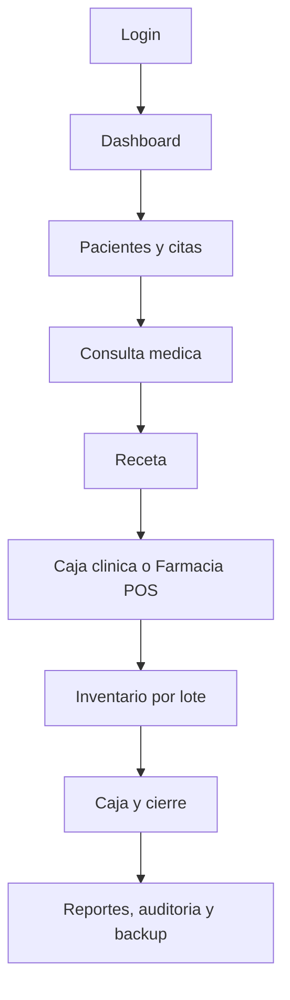

# Clinicapharma - Guia operativa viva

Ultima revision: 2026-06-23

Esta guia explica el por que y el flujo de uso de cada modulo. Complementa `module-flows.md`: aqui el enfoque es operativo para entrega, capacitacion y soporte.

## Proposito

Clinicapharma debe ayudar a una clinica con farmacia a operar el dia completo sin perder trazabilidad: quien atendio, quien cobro, que se vendio, que lote salio, que vence, que quedo en caja y que debe respaldarse.

## Flujo completo del sistema

## 1. Login, usuarios y permisos

Por que existe:

- Identifica quien realiza cada accion.
- Reduce errores mostrando solo modulos permitidos.
- Permite auditoria de acciones sensibles.

Flujo:

1. Usuario entra con credenciales.
2. Sistema valida usuario activo.
3. UI muestra modulos segun permisos.
4. Acciones sensibles quedan listas para auditoria.

Riesgo que controla:

- Evita que personal sin permiso toque caja, usuarios, configuracion, inventario o reportes sensibles.

## 2. Dashboard

Por que existe:

- Es la vista de control del dia.
- Debe responder que requiere atencion ahora.

Debe mostrar:

- Citas pendientes/proximas.
- Ventas/cobros del dia.
- Alertas de bajo stock, vencimientos y lotes estancados.
- Accesos rapidos a modulos segun rol.

Regla:

- El dashboard resume, no reemplaza los modulos. Las operaciones completas viven en Pacientes, Citas, Consulta, Farmacia, Inventario, Cajas y Reportes.

## 3. Pacientes y expediente

Por que existe:

- Centraliza datos personales, historial clinico, consultas, recetas y puntos de farmacia.

Flujo:

1. Recepcion busca paciente por nombre, telefono o identidad.
2. Si no existe, lo registra.
3. Doctor/enfermeria agrega consulta o preconsulta.
4. Recetas y cobros quedan relacionados al paciente cuando aplique.

Riesgo que controla:

- Evita expedientes duplicados y perdida de historial clinico.

## 4. Citas

Por que existe:

- Ordena la atencion y evita olvidar pacientes pendientes.

Flujo:

1. Recepcion agenda cita con fecha, hora, doctor y motivo.
2. Dashboard alerta desde dias antes.
3. La cita queda visible hasta atenderse o cancelarse.
4. Puede enviarse recordatorio por WhatsApp.

Riesgo que controla:

- Evita citas perdidas y reduce llamadas manuales.

## 5. Consulta y receta

Por que existe:

- Registra la atencion medica y genera salida clinica clara para paciente/farmacia.

Flujo:

1. Doctor abre paciente.
2. Registra signos, historia, diagnostico, tratamiento y seguimiento.
3. Si aplica, crea receta vinculada.
4. Receta puede imprimirse/exportarse.

Regla:

- La receta no reemplaza la consulta; debe quedar vinculada cuando nace desde atencion clinica.

## 6. Caja clinica

Por que existe:

- Controla pagos por consulta o servicios clinicos.

Flujo:

1. Cajero registra recibo clinico.
2. Selecciona metodo: efectivo, tarjeta o transferencia.
3. Si es transferencia, registra banco/referencia.
4. Recibo queda disponible para copiar/imprimir.

Riesgo que controla:

- Evita cobros sin comprobante o sin metodo de pago claro.

## 7. Farmacia POS

Por que existe:

- Convierte venta de farmacia en salida de inventario, recibo, puntos y utilidad.

Flujo:

1. Cajero busca producto por nombre, SKU, barcode o lote.
2. Selecciona presentacion y cantidad.
3. Asocia cliente/paciente o consumidor final.
4. Aplica descuento o puntos si corresponde.
5. Cobra.
6. Backend descuenta stock vigente de tienda por FEFO/FIFO.
7. Venta registra lote, costo, utilidad, puntos y recibo.

Reglas criticas:

- La venta descuenta tienda, no bodega.
- Lotes vencidos no son vendibles.
- Si se escanea un lote vencido, el POS debe bloquear la venta.
- Descuentos de tercera/cuarta edad usan precio de vineta y deben respetar evidencia/regla.
- Evidencias y documentos clinicos se suben desde el expediente del paciente en Adjuntos y evidencias.

## 8. Inventario

Por que existe:

- Controla productos, presentaciones, lotes, vencimientos, ubicaciones, costos y movimientos.

Flujo:

1. Usuario crea producto y presentaciones.
2. Registra lote con vencimiento, costo, bodega y tienda.
3. Traslada bodega a tienda cuando se requiere vender.
4. Registra merma/perdida con razon.
5. Revisa alertas de bajo stock, vencimiento y lotes estancados.

Riesgo que controla:

- Evita vender vencidos, quedarse sin producto o perder trazabilidad de mermas.

## 9. Cajas formales

Por que existe:

- Permite cerrar turno por modulo/cajero y comparar esperado contra contado.

Flujo:

1. Cajero abre caja con monto inicial.
2. Sistema acumula pagos segun modulo.
3. Cajero ingresa conteos por efectivo, tarjeta y transferencia.
4. Backend calcula diferencia.
5. Si hay diferencia, exige nota.

Riesgo que controla:

- Evita cierres de dia sin responsable ni diferencia explicada.

## 10. Reportes y auditoria

Por que existe:

- Responde que paso, quien lo hizo y donde hay riesgo operativo.

Debe cubrir:

- Ventas, cobros, utilidad, puntos, vencimientos, stock bajo, caja y acciones sensibles.

Uso actual:

1. Admin abre Reportes para revisar resumen gerencial, alertas, graficos y puntos.
2. Admin revisa ventas por dia/cajero/metodo, utilidad por lote, productos top, productos estancados, stock bajo, vencimientos y movimientos de puntos.
3. Admin copia CSV de cada bloque si necesita analizar datos fuera del sistema.
4. Admin abre Auditoria cuando necesite saber quien hizo una accion sensible.
5. Admin filtra por modulo, entidad o id y revisa antes/despues cuando aplique.

Regla:

- Los reportes no deben inventar totales. Deben calcular desde ventas, recibos, movimientos, caja y auditoria.

## 10.1 Adjuntos y evidencias

Por que existe:

- Evita que DNI, recetas externas, estudios y soportes de descuento queden fuera del expediente.

Uso actual:

1. Abrir expediente del paciente.
2. Ir a Adjuntos y evidencias.
3. Elegir tipo, escribir nota y seleccionar PDF o imagen.
4. Descargar o eliminar desde el mismo panel si se necesita.

Regla:

- Subir y eliminar adjuntos queda auditado; los archivos se guardan localmente fuera de Git.

## 11. Facturacion SAR

Por que existe:

- Si el cliente emitira facturas reales desde el sistema, debe controlar CAI, rango, correlativo, documentos fiscales, anulaciones, notas de credito y reportes.

Flujo:

1. Admin registra autorizacion SAR con CAI, rango, correlativo, punto de emision y fecha limite.
2. Caja cobra consulta o venta.
3. Usuario emite recibo interno o factura SAR.
4. Si es factura SAR, el sistema valida autorizacion vigente y consume correlativo.
5. La factura puede reimprimirse sin consumir numero nuevo.
6. Anulacion o nota de credito exige motivo y permiso.
7. Admin revisa reporte fiscal y correlativos no usados.

Regla:

- Si SAR completo no esta implementado y validado por contador/cliente, la instalacion debe quedar en modo recibos internos.

## 12. Backup y recuperacion

Por que existe:

- La base local es el activo principal del negocio.

Rutina recomendada:

1. Backup diario al cerrar.
2. Backup semanal externo.
3. Verificar archivo y SHA256.
4. Probar restore antes de entrega y luego periodicamente.

## Checklist para cada cambio nuevo

Antes de construir:

1. Definir problema operativo.
2. Definir roles permitidos.
3. Definir datos que crea/modifica.
4. Definir endpoints y tablas afectadas.
5. Definir auditoria necesaria.
6. Definir prueba minima.

Al terminar:

1. Ejecutar pruebas/build aplicables.
2. Actualizar `requirements.md`, `module-flows.md`, `api-contract.md`, `database-schema.md`, `roadmap.md` y `changelog.md` si corresponde.
3. Actualizar esta guia si cambia un flujo de uso importante.
